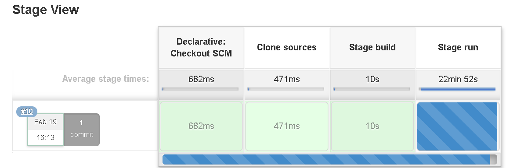

# Predictive healthcare application

We are designing an application which can provide the nearest outdoor activities focused on health. Dataset has multipleoutdoor activities, our application will be presenting the user with activities which can help with a healthy living. 

## Dataset

* https://data.gov.ie/dataset/west-regional-authority-outdoor-recreation-strategy
* https://data.gov.ie/dataset/outdoor-exercise-equipment
* https://data.gov.ie/dataset/play-areas

## Steps taken

* Database / Tables created 
* CSV dataset loaded to Mysql database with script deployment/import.sh
* User table intialized for register/login
* Worked on Backend 
* Worked on Frontend 

## Features: 

* Sign up
* User login 
* Suggestion of the nearest outdoor activity available to user
* Ability to track the workout

## Technology pipeline

* Spring bootframework
* Mysql DB  
* HTML/CSS + bootstrap + Knockoutjs
* Cloud AWS RDS/EC2

## Deployment pipeline 

* Jenkins : http://34.219.71.158:8080/job/Deploy/ 
* Deployment to AWS
* Backend available at : http://34.219.71.158:5000/api/
